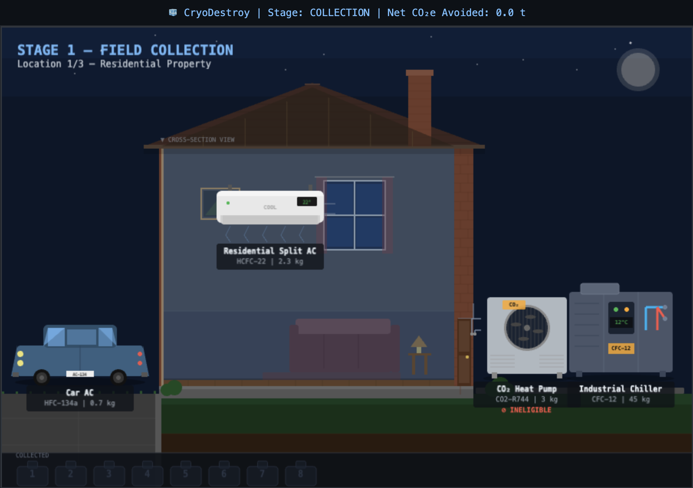
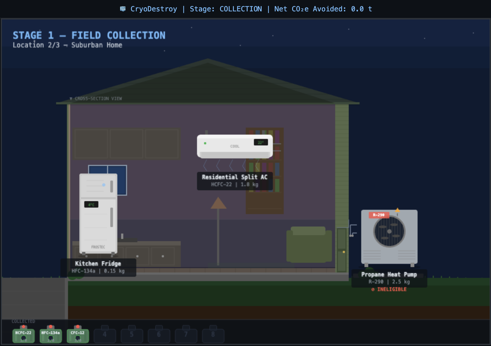
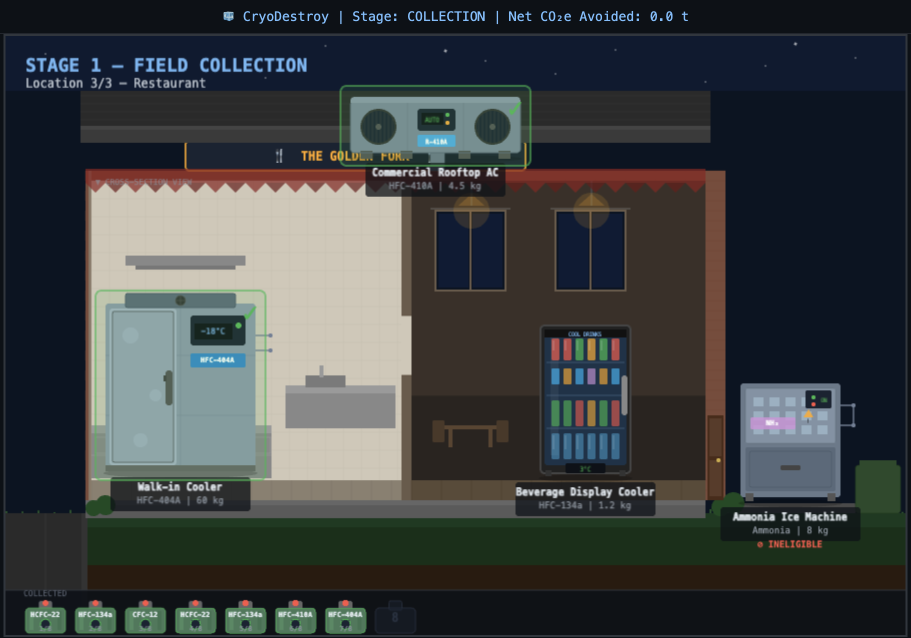
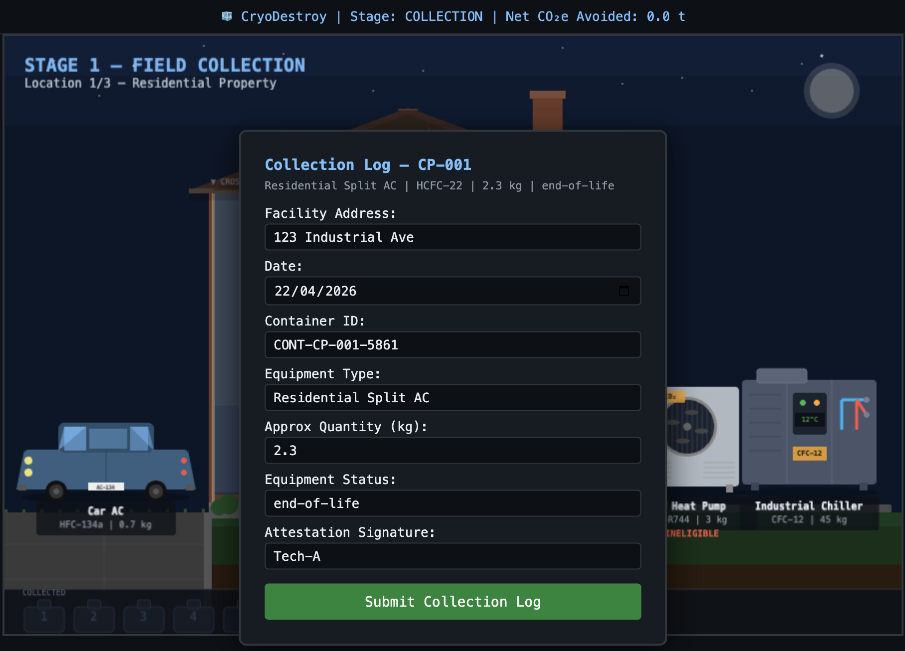
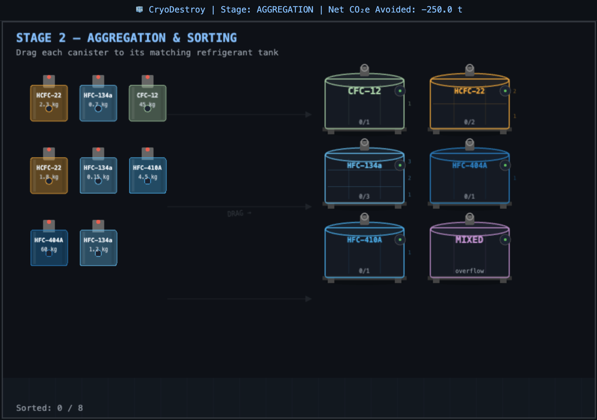
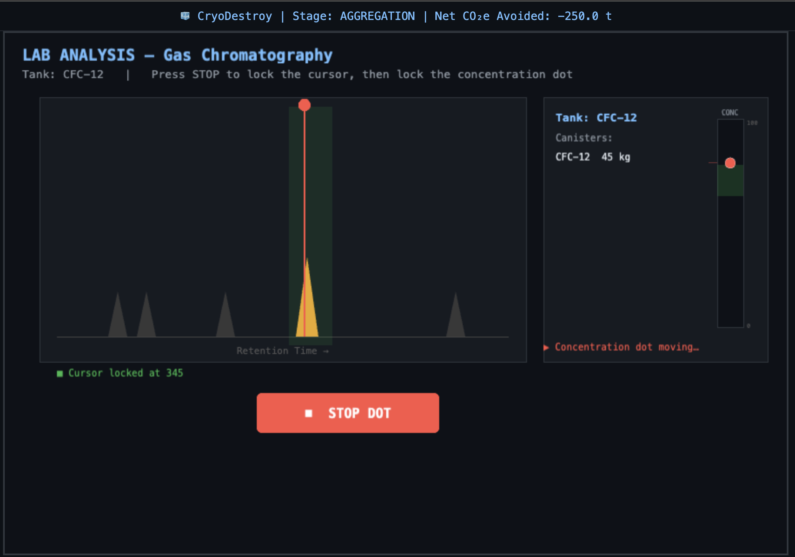
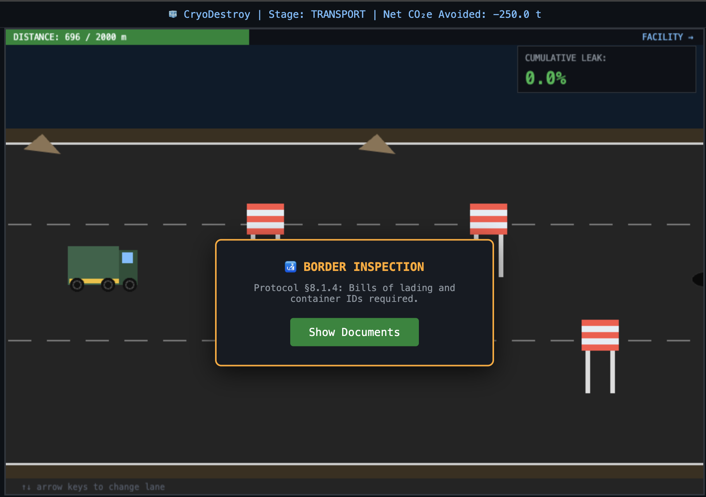
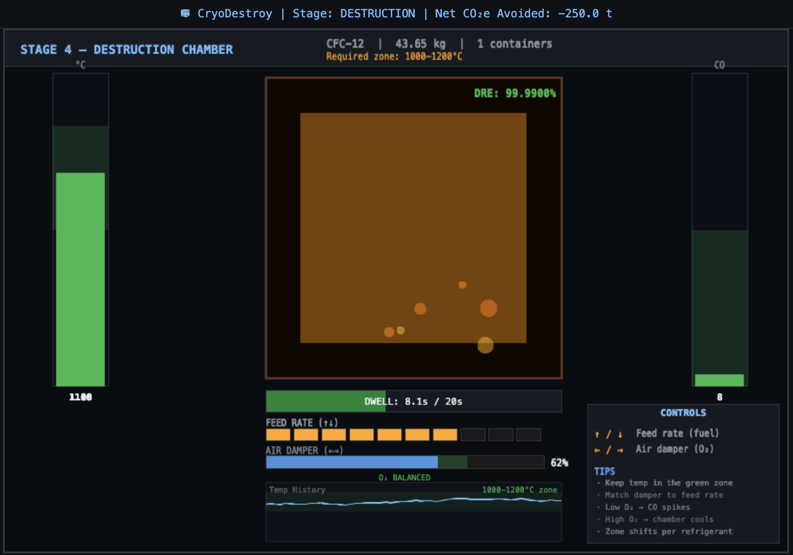
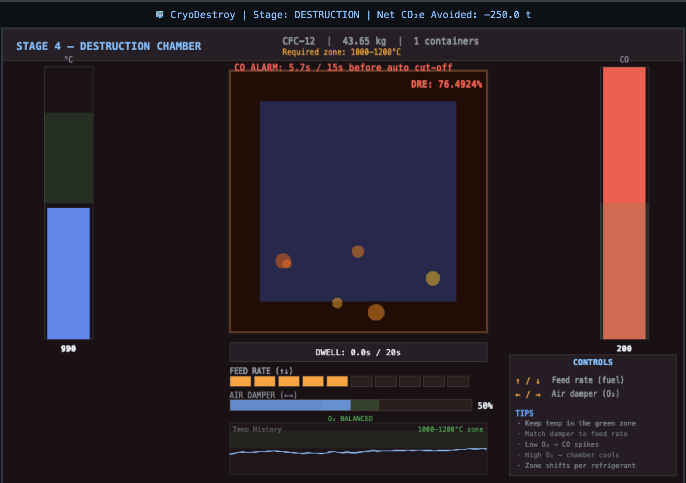
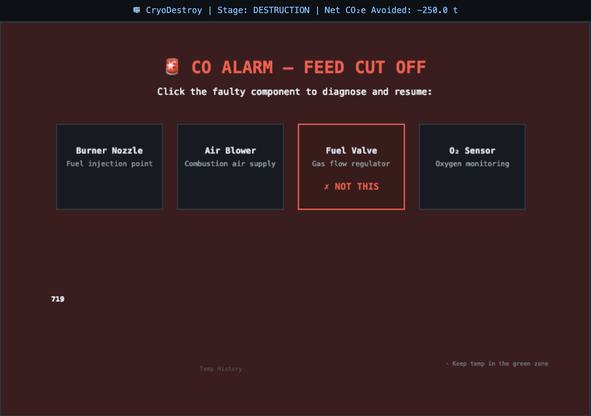

# CryoDestroy

An educational strategy game that simulates the end-to-end process of refrigerant destruction for carbon credit generation. Players guide refrigerant containers through a 4-stage chain of custody — from field collection to high-temperature incineration — making decisions that affect the final carbon credit yield.

The game is based on real-world ODS (Ozone Depleting Substances) and HFC destruction protocols, including IPCC AR6 GWP-100 values and Montreal Protocol classifications.

## How to Play

The goal is to collect, sort, analyze, transport, and destroy refrigerant containers while minimizing emissions and maximizing carbon credits. Mistakes at any stage carry forward as penalties that reduce your final score.

### Stage 1 — Field Collection (Point and Click)

Visit 3 locations (residential property, suburban home, restaurant) and click on HVAC equipment to collect refrigerant containers. Each piece of equipment displays its refrigerant type — click to collect eligible ones.

After collecting a container, fill out a collection log form (facility address, date, container ID, quantity). Missing or incorrect fields trigger a **Provenance Gap** penalty that follows you through later stages and causes border inspection failures in Stage 3.

There are 8 eligible containers spread across all three locations. Ineligible refrigerants (CO2-R744, R-290, Ammonia) are present as traps — collecting them costs points.

Once all eligible containers at a location are collected, a "Next Location" button appears.

| Residential Property | Suburban Home | Restaurant |
|:---:|:---:|:---:|
|  |  |  |



### Stage 2 — Aggregation & Sorting (Drag and Drop)

**Sorting phase:** Drag each collected canister into the correct refrigerant tank. Tanks are labeled by refrigerant type (HFC-134a, CFC-12, HCFC-22, etc.) with a MIXED overflow bin available.

- Correct placement fills the tank with a liquid animation
- Wrong tank in the same class (e.g. HFC-134a into HFC-410A): sorting penalty + emission increase
- Wrong class entirely: larger sorting penalty
- MIXED bin always accepts but uses the lowest GWP value, reducing credits

**Lab analysis phase:** After sorting, each tank goes through a gas chromatography mini-game. A red cursor auto-scrolls across a GC chart with peaks — press STOP to lock the cursor on the target peak. Then a concentration dot bounces on a vertical gauge — press STOP again to lock it near the target value.

- Accurate readings (both cursor and concentration within tolerance): full mass credited
- Inaccurate readings: 15% mass penalty applied to that tank's containers

| Sorting Phase | Lab Analysis (Gas Chromatography) |
|:---:|:---:|
|  |  |

### Stage 3 — Transport (Arrow Keys)

Drive a truck 2000 m along a 3-lane road to the destruction facility.

| Control    | Action             |
|------------|--------------------|
| Arrow Up   | Move up one lane   |
| Arrow Down | Move down one lane |

Hazards spawn randomly across all lanes:

- **Potholes** (dark ellipses): 1.5% refrigerant leak + emission penalty
- **Debris** (brown triangles): 3% leak + emission penalty
- **Border inspections** (checkpoint barriers): stops the truck and checks documentation. If you have a Provenance Gap from Stage 1, the inspection fails with a 15% leak penalty

A cumulative leak gauge is displayed. If total leakage exceeds 10%, a **Leakage Penalty** flag is set and eligible mass is reduced proportionally.



### Stage 4 — Destruction (Arrow Keys)

Manage a high-temperature destruction chamber for each batch of containers, grouped by refrigerant type.

Each batch starts with a pre-destruction weighing dialog. Then you control the chamber:

| Control     | Action                              |
|-------------|-------------------------------------|
| Arrow Up    | Increase feed rate (more fuel)      |
| Arrow Down  | Decrease feed rate (less fuel)      |
| Arrow Right | Open air damper (more O2)           |
| Arrow Left  | Close air damper (less O2)          |

The destruction zone temperature range varies per refrigerant (e.g. HCFC-22 needs 1000-1250 C, HFC-134a needs 850-1100 C). Keep the chamber temperature in the green zone while managing the air-to-fuel ratio:

- **Temperature too low**: incomplete combustion, CO rises rapidly
- **Temperature too high**: CO rises slightly
- **Air damper mismatched to feed rate**: O2 imbalance causes CO spikes regardless of temperature
- **Thermal drift**: the chamber chemistry shifts over time, requiring constant adjustment

A dwell timer counts up while temperature is in the green zone. A batch completes when dwell time reaches 20 seconds and DRE (Destruction and Removal Efficiency) is at least 99.99%.

If CO stays above 100 mg/Nm3 for 15 seconds, the feed is automatically cut and a **diagnostic puzzle** triggers: four components are shown (Burner Nozzle, Air Blower, Fuel Valve, O2 Sensor) — click the faulty one to resume. Wrong guesses increase CO further. Each CO alarm adds a 5% penalty to the batch's gross avoided emissions.

After destruction, an empty container weighing dialog calculates the net mass destroyed.

| Stable Chamber | CO Alarm | Diagnostic Puzzle |
|:---:|:---:|:---:|
|  |  |  |

### Scorecard

After all batches are destroyed, a GHG Statement is displayed showing:

- **Baseline CO2e**: emissions if the refrigerants had been vented to atmosphere
- **Project Emissions**: CO2 from the destruction process + all penalties
- **Net CO2e Reduction**: baseline minus project emissions
- **Carbon Credits Issued**: floor of net reduction (in tCO2e)
- **Destruction Records**: per-container DRE, mass destroyed, and direct CO2
- **Penalty Flags**: all triggered penalties listed with descriptions

Grades:
| Grade | Criteria |
|-------|----------|
| A+    | >500 credits, zero penalties |
| B     | >300 credits |
| C     | <300 credits |

## Penalty System

Penalties accumulate across stages and compound to reduce your final credit yield:

| Penalty | Trigger | Effect |
|---------|---------|--------|
| Provenance Gap | Missing collection log fields (Stage 1) | Containers excluded from eligible mass; border inspection failure in Stage 3 |
| Sorting Error | Wrong bin placement (Stage 2) | 10% of container's CO2e added to project emissions |
| Lab Inaccuracy | Off-target GC reading (Stage 2) | 15% mass penalty on affected containers |
| Leakage >10% | Cumulative transport damage (Stage 3) | Eligible mass reduced by leak percentage |
| CO Alarm | Sustained high CO in chamber (Stage 4) | 5% penalty per alarm on batch gross avoided; additional emissions from wrong diagnoses |

## Refrigerants

The game features 10 refrigerant types based on Montreal Protocol classifications:

| Refrigerant | Class | GWP-100 | Eligible | Destruction Temp |
|-------------|-------|---------|----------|------------------|
| HFC-134a | HFC | 1,530 | Yes | 850-1100 C |
| HFC-410A | HFC | 2,088 | Yes | 900-1150 C |
| HFC-404A | HFC | 3,922 | Yes | 900-1100 C |
| HFC-23 | HFC | 14,600 | Yes | 1050-1250 C |
| CFC-12 | CFC | 10,200 | Yes | 1000-1200 C |
| CFC-11 | CFC | 4,750 | Yes | 950-1200 C |
| HCFC-22 | HCFC | 1,960 | Yes | 1000-1250 C |
| CO2-R744 | Other | 1 | No | — |
| Ammonia | Other | 0 | No | — |
| R-290 | Other | 3 | No | — |

GWP values are from IPCC AR6. Ineligible refrigerants (CO2-R744, Ammonia, R-290) appear as traps during collection.

## Technical Details

- **Engine**: [Phaser 3.80.1](https://phaser.io/) loaded via CDN — no build step required
- **Language**: Vanilla JavaScript (ES modules)
- **Rendering**: Phaser Canvas/WebGL with programmatic graphics (no sprite assets)
- **UI Overlays**: DOM-based HUD and modal panels layered over the Phaser canvas
- **Resolution**: 900 x 600 pixels
- **Physics**: Custom tick-based simulation (100ms fixed timestep) for destruction chamber thermodynamics

### Architecture

The game uses a shared `gameState` object passed through Phaser's registry system. Each stage is a Phaser Scene that reads from and writes to this shared state, allowing penalties and container data to flow across stages.

```
.
├── index.html              Entry point (loads Phaser 3 via CDN)
├── main.js                 Phaser config, game state, scene registry
├── stages/
│   ├── collection.js       Stage 1: point-and-click field collection
│   ├── aggregation.js      Stage 2: drag-and-drop sorting + GC lab mini-game
│   ├── transport.js        Stage 3: lane-dodging truck driving
│   ├── destruction.js      Stage 4: chamber temperature management
│   └── transition.js       Inter-stage summary overlay
├── ui/
│   ├── hud.js              DOM overlay for alerts, success messages, modal panels
│   └── scorecard.js        Final GHG statement and grade display
└── data/
    └── refrigerants.js     Refrigerant metadata (GWP, eligibility, destruction temps)
```

## Getting Started

The game uses ES modules, so it must be served over HTTP (opening the HTML file directly won't work). No dependencies to install — just start a local server:

```bash
# Python (built into macOS/Linux)
python3 -m http.server 8000

# or Node.js
npx serve .
```

Then open **http://localhost:8000** in your browser.

### Dev Shortcut

Jump to a specific stage with a URL parameter:

```
http://localhost:8000?stage=AGGREGATION
http://localhost:8000?stage=TRANSPORT
http://localhost:8000?stage=DESTRUCTION
http://localhost:8000?stage=SCORECARD
```

When skipping stages, the game populates dummy container data so later stages work correctly.

## Hosting

This is a fully static site with no build step or server-side code. Deploy by pointing any static host at the repository root:

- **GitHub Pages**: Settings > Pages > Source: main branch, root (`/`)
- **Vercel / Netlify**: Import the repo, set framework to "Other", no build command needed
